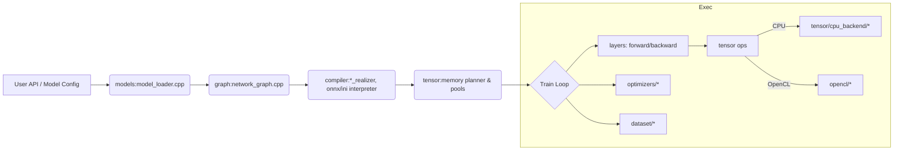

# NNTrainer Architecture Overview

## Purpose
On-device training framework with modular graph/layer/tensor pipeline optimized for low-memory devices.

## Lifecycle
1) **Load/Configure** → models, graph, layers
2) **Compile** → compiler (realizers, interpreters, graph optimizers)
3) **Initialize** → tensor (tensor pool, memory planner), utils (threads, profiler)
4) **Train/Evaluate** → layers + tensor backends (CPU/OpenCL), optimizers, dataset

